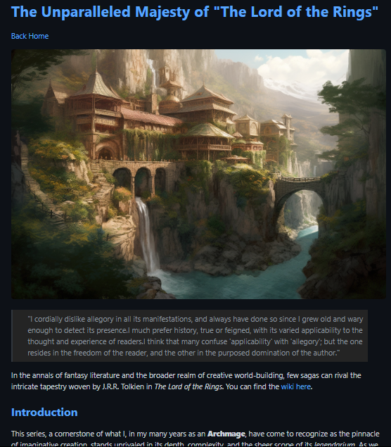

# Static Site Generator

Within this project I created a static site generator that takes markdown content as an input and outputs a formatted html file. 

The intention is to automate the generation of static web content such as blog posts, articles, and galleries using simplistic markdown format files.  

## Example Output:

### Supports: 

* blockquotes
* code blocks
* images
* links
* inline elements
* unordered-list
* ordered-list

As well as automatically mimicking file structure from generated content directories

